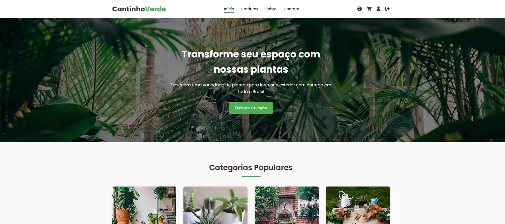

# E-commerce Cantinho Verde 🌿

  
_Um e-commerce completo para amantes de plantas e jardinagem_

## 📋 Visão Geral

O Cantinho Verde é um projeto de e-commerce desenvolvido com tecnologias web modernas seguindo o padrão MVC (Model-View-Controller). Esta solução oferece:

- Catálogo de produtos completo
- Sistema de autenticação de usuários
- Carrinho de compras funcional
- Painel administrativo
- Integração com banco de dados MySQL

## 🚀 Tecnologias Utilizadas

| Camada         | Tecnologias                    |
| -------------- | ------------------------------ |
| Frontend       | HTML5, CSS3, JavaScript (ES6+) |
| Backend        | PHP 7.4+                       |
| Banco de Dados | MySQL 5.7+                     |
| Arquitetura    | Padrão MVC                     |
| Ferramentas    | XAMPP, phpMyAdmin              |

## ⚙️ Pré-requisitos

Antes de começar, verifique se você possui:

- [XAMPP](https://www.apachefriends.org/pt_br/index.html) (versão com PHP 7.4+)
- Navegador moderno (Chrome, Firefox, Edge)
- 500MB de espaço livre
- Conexão com a internet (apenas para download inicial)

## 🛠️ Instalação Passo a Passo

### 1. Configuração do Ambiente

```bash
# Clone o repositório (se estiver usando Git)
git clone https://github.com/seu-usuario/e-commerce-prog-web.git
```

OU

Baixe o arquivo ZIP do projeto

Extraia o conteúdo para `C:\xampp\htdocs\e-commerce-prog-web`

### 2. Configuração do Banco de Dados

Acesse o phpMyAdmin em `http://localhost/phpmyadmin`

Crie um novo banco de dados chamado `cantinhoverde_db`

Importe os arquivos SQL na seguinte ordem:

```sql
-- Primeiro a estrutura
SOURCE C:/xampp/htdocs/e-commerce-prog-web/doc/sql/CREATE TABLE/database.sql

-- Depois os dados iniciais
SOURCE C:/xampp/htdocs/e-commerce-prog-web/doc/sql/INSERT/INSERT.sql
```

### 3. Configuração do Projeto

Edite o arquivo de configuração principal:

```php
// cantinhoVerdeMVC/app/config/config.php
define(\'BASE_URL\', \'http://localhost/e-commerce-prog-web/cantinhoVerdeMVC/public\');
```

Dica: Verifique se o caminho corresponde à sua estrutura de diretórios.

## 🖥️ Executando o Projeto

Inicie os serviços no XAMPP:

- Apache
- MySQL

Acesse no navegador:

```text
http://localhost/e-commerce-prog-web/cantinhoVerdeMVC/public
```

**Credenciais de teste:**

- Admin: `carlos.admin@empresa.com` / `password`
- Admin: `fernanda.admin@empresa.com` / `password`
- Admin: `ricardo.admin@empresa.com` / `password`
- Cliente: `cliente@email.com` / `password`

## 🗂️ Estrutura do Projeto

```text
📦 e-commerce-prog-web
├── 📂 cantinhoVerdeMVC
│   ├── 📂 app
│   │   ├── 📂 config       # Configurações globais
│   │   ├── 📂 controllers  # Lógica de controle
│   │   ├── 📂 core         # Núcleo do MVC
│   │   ├── 📂 helpers      # Funções auxiliares
│   │   ├── 📂 models       # Modelos de dados
│   │   ├── 📂 utils        # Utilitários
│   │   └── 📂 views        # Templates e páginas
│   └── 📂 public           # Arquivos acessíveis publicamente
│       ├── 📂 css          # Folhas de estilo
│       ├── 📂 images       # Imagens do site
│       ├── 📂 js           # Scripts JavaScript
│       └── index.php       # Ponto de entrada
├── 📂 doc                  # Documentação
│   ├── 📂 pdf              # Manuais e apresentações
│   └── 📂 sql              # Scripts SQL
│       ├── 📂 CREATE TABLE # Estrutura do BD
│       └── 📂 INSERT       # Dados iniciais
├── LICENSE
├── README.md
└── todo.todo               # Roadmap e tarefas
```

## 🤝 Contribuição

- Faça um fork do projeto
- Crie uma branch (`git checkout -b feature/nova-feature`)
- Commit suas mudanças (`git commit -m 'Adiciona nova feature'`)
- Push para a branch (`git push origin feature/nova-feature`)
- Abra um Pull Request

## 📄 Licença

Este projeto está licenciado sob a MIT License - veja o arquivo `LICENSE` para detalhes.
